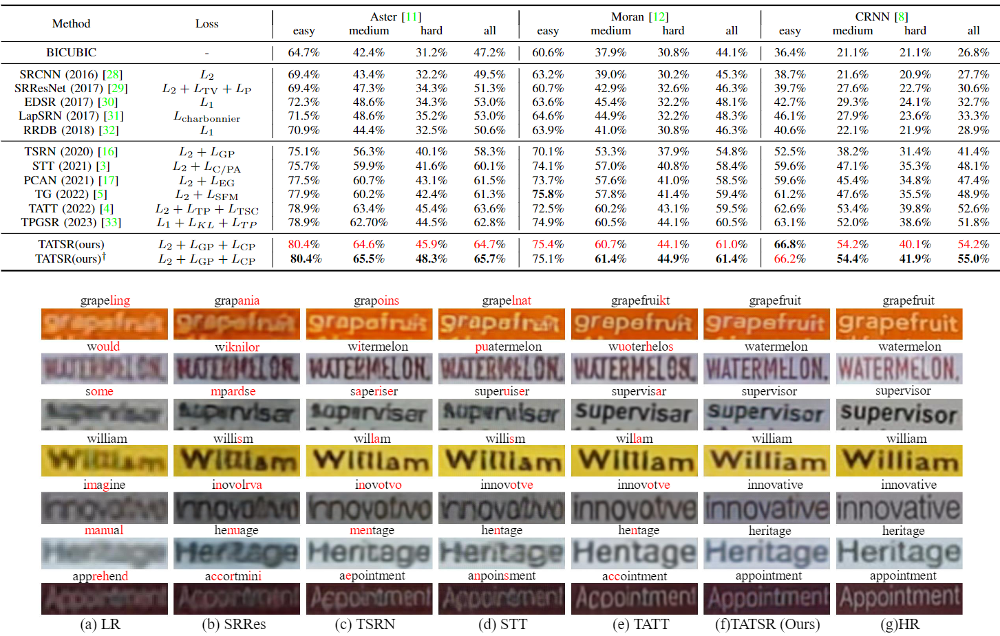

# Scene Text Image Super-Resolution via Content Perceptual Loss and Criss-Cross Transformer Blocks (IJCNN 2024)

[](https://arxiv.org/abs/2210.06924)



## **Environment**
- Ubuntu <= 20.04 LTS
- CUDA == 10.2
- GCC-7, G++-7
- Python 3.7.1

```Since NVIDIA graphics above the 30-series no longer support CUDA versions prior to 11.0, you need to use a graphics card earlier than or equal to a 2080Ti, e.g. 1080Ti/V100.```

## Dataset:

- Training Dataset
    - TextZoom (train): Data (Lmdb):  [Google Drive](https://drive.google.com/drive/folders/1WRVy-fC_KrembPkaI68uqQ9wyaptibMh?usp=sharing). (Dataset proposed by [WenjiaWang0312/TextZoom: A super-resolution dataset of paired LR-HR scene text images (github.com)](https://github.com/WenjiaWang0312/TextZoom))
- Validation Dataset
    - TextZoom (test): Data (Lmdb): same as mentioned above.
    - STR-LR Datasets: Data (Lmdb): [Google Drive](https://drive.google.com/drive/folders/1rrE0sUg2NgptbxMTn7pjOcoK2nKQ0vQZ?usp=sharing)

## **Installation**

* Clone the repository.

  ```bash
  git clone https://github.com/Imalne/TATSR.git
  ```

* We recommend using anaconda for environment management. 

  ```bash
  conda create -n TATSR python=3.7.1
  conda activate TATSR
  ```

- Install python packages in ```requirements.txt```.
    ```bash
    cd ./TATSR
    pip3 install Cython==0.29.35
    pip3 install pyfasttext==0.4.6
    pip3 install -r requirements.txt
    ```

- Download pretrained weights for STR models, and move them into the `./pretrained_weights` folder.
    - Aster model from https://github.com/ayumiymk/aster.pytorch, 
    - Moran model from https://github.com/Canjie-Luo/MORAN_v2,
    - CRNN model from https://github.com/meijieru/crnn.pytorch.
    ```
    ./pretrained_weights
        ├── Aster_demo.pth.tar
        ├── MORAN_demo.pth
        └── crnn.pth
    ```

- Modify the configuration file named **ckpt/folder_name/super_resolution.yaml** with your own path.
    - Change `TRAIN.VAL.rec_pretrained` to your Aster model path, 

    - Change `TRAIN.VAL.moran_pretrained` to your MORAN model path
    
    - Change `TRAIN.VAL.crnn_pretrained` to your CRNN  model path.
    
    - Change `TRAIN.train_data_dir` to your train data path.
    - Change `TRAIN.VAL.val_data_dir` to your val data path.


## **Quick Inference**
Download the pretrained weights [[Google Drive]](https://drive.google.com/drive/folders/1T15Kotp1eliNR1qIlXG6SeYKuoGB3lPL?usp=sharing) and put them into the **`./ckpt/*`** directories.


### Validation on Single Dataset

Change the `*********` into your own selection and execute the commands.
- `rec`: the recognizer method used in validation, which can be 'aster' (Default), 'moran' or 'crnn'.
- `test_data_dir`: the path of you validation dataset directory.
- `save_dir`: path for saving the results.
```bash
cd ./src/
python3 main.py \
    --arch tsrn \
    --rec ********* \
    --batch_size 1 \
    --test \
    --test_data_dir ********* \
    --resume ../ckpt/with_test/model_best.pth \
    --STN \
    --mask \
    --gradient \
    --nonlocal_type transformer \
    --srb 4 \
    --save_dir  ../ckpt/with_test/result/********* \
    --conv_num 2 \
    --config_path ../ckpt/with_test  \
    --hd_u 64 \
    | tee -a ../ckpt/with_test/result.txt
```


### Quick Validation

If you have downloaded all of the above validation and place them in a directory with the following structure,
```
parent_folder_name
    ├── TextZoom/
    └── low_res_all/
```
you can run these commands for quick validation.
```bash
cd ./src
sh ./quick_validation.sh `parent_folder_name` `batch_size` 
# for example, 'sh quick_validation.sh ./datasets 1'
```


## **Train from scratch**

Train with Textzoom
```bash
cd ./src/
sh train.sh
```

Train with Textzoom† (augmentation with synthestic degradation)

```bash
cd ./src/
sh train_aug.sh
```


## Acknowledgement
We inherited most of the frameworks from [TextZoom](https://github.com/WenjiaWang0312/TextZoom). Thanks for your contribution! [@WenjiaWang](https://github.com/WenjiaWang0312/) 


## Contact

If you have any questions, please create an issue or email [qrimalne@gmail.com](mailto:qrimalne@gmail.com).
